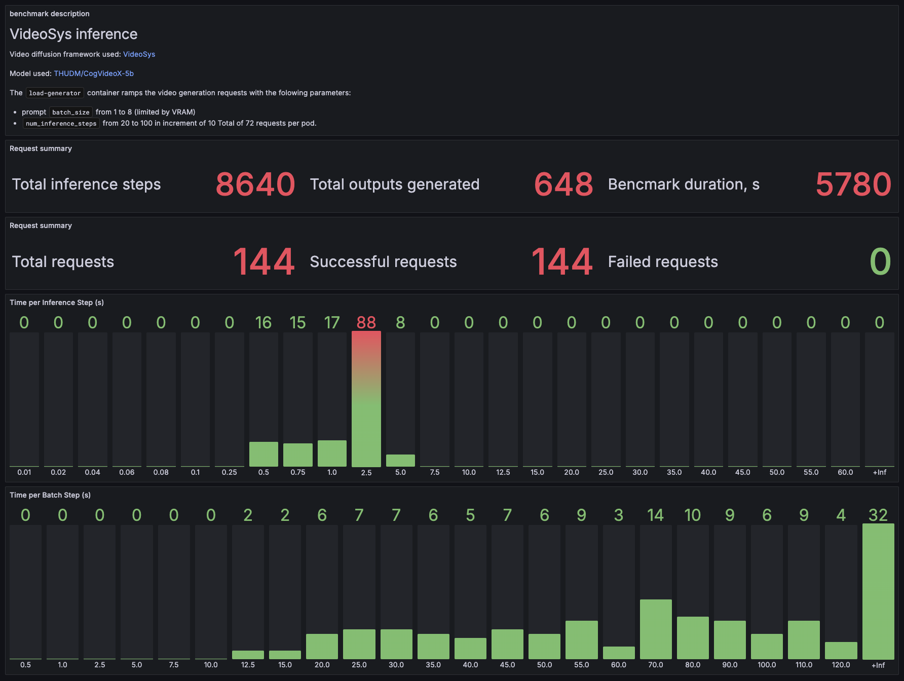

# diffusion-inference-benchmark

## Description

This Helm chart deploys a fixed ammount of pods (`replicaCount`) with 2 containers:
1. `videosys-server` with the following parameters:
    ```
    export SERVED_MODEL={{ .Values.servedModel }}
    ```
    where `{{ .Values.servedModel }}` corresponds to the model running on the `videosys-server`. It includes Pyramid Attention Broadcast optimization in a multi-GPU setup. It uses all the GPUs available to the container automatically.

2. `load-generator` is a FastAPI application which serves requests for videeo generation. The `load-generator` container ramps the video generation requests with the folowing parameters:
    - prompt `batch_size` from 1 to 8 (limited by VRAM)
    - `num_inference_steps` from 20 to 100 in increment of 10
    Total of 72 requests per pod.

    Payload example received by the `videosys-server`:
    ```json
    {
    "prompt": [
        "Sunset over the sea.",
        ] * batch_size,
    "num_inference_steps": num_inference_steps,
    "seed": -1,
    "cfg": 6.5,
    "save_disk_path": "/results"
    }
    ```

## Installation

First, you need to install `model-storage` for accessing s3 buckets with model weights and for saving results. Make sure you install it in the same namespace with this Helm chart. You will also need your Hugging Face token for this.
```bash
export HF_TOKEN=<hf_token>
helm install diffusion-benchmark . \                 
  --namespace=<job-namespace> \
  --set hfToken=$HF_TOKEN
```
To check on the benchmark progress, connect to `grafana`:
```bash
kubectl --namespace o11y port-forward service/grafana 8080:80
```
You may create a dashboard with the contents of `grafana_dashboard.json` for monitoring:

